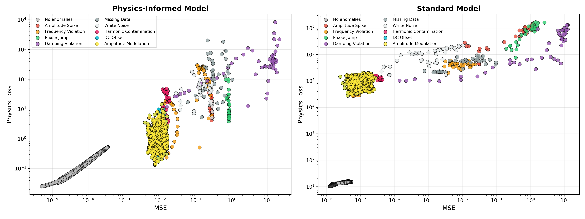

# Anomaly Classification via Physics-Informed Loss Geometry

We propose using physics loss as a system diagnostic tool rather than a training validation protocol in data sparse systems. We demonstrate the core operating principles by an example of an unsupervised anomaly classification via physics-informed LSTM network in a time-series data.

At inference time, the physics-informed LSTM autoencoder maps each signal window into a 2D loss space, consisting of

- Reconstruction error (log MSE)
- Physics violation (log residual)

We find that this space becomes linearly separable by anomaly type, enabling structured separation of anomaly types in physics-induced loss space.

## Key finding

Physics-informed losses induce structured geometry in error space, where different anomaly modes occupy distinct regions. This enables

- unsupervised anomaly detection
- downstream anomaly type classification in the same representation space

## Main results

Across 30 seeds and 4 frequencies

- detection improves consistently under physics constraints
- classification benefit is strongest in data sparse regimes

### 2D loss space

### Small vs large dataset

| Small dataset | Large dataset |
|---|---|
|  |  |

For a more in-depth explanation, see [notes.md](notes.md). These notes contain more quantative information and additional figures. 

## Tech stack

- PyTorch
- NumPy / SciPy
- scikit-learn (GMM, kNN)
- Optuna (hyperparameter search)
- MLflow (experiment tracking)
