# Anomaly Classification via Physics-Informed Loss Geometry

## Summary

This project studies how physics-informed losses shape representation space in time-series anomaly detection.
In a noisy and variable setting, anomaly types become separable in a 2D loss space defined by
reconstruction error and physics violation, enabling simple downstream classification after unsupervised detection.

Evaluated across **30 seeds and 4 frequencies** on both a small (10k timesteps) and a large (400k timesteps)
dataset using a Physics-Informed LSTM autoencoder with Optuna hyperparameter optimisation and MLflow experiment tracking.

---

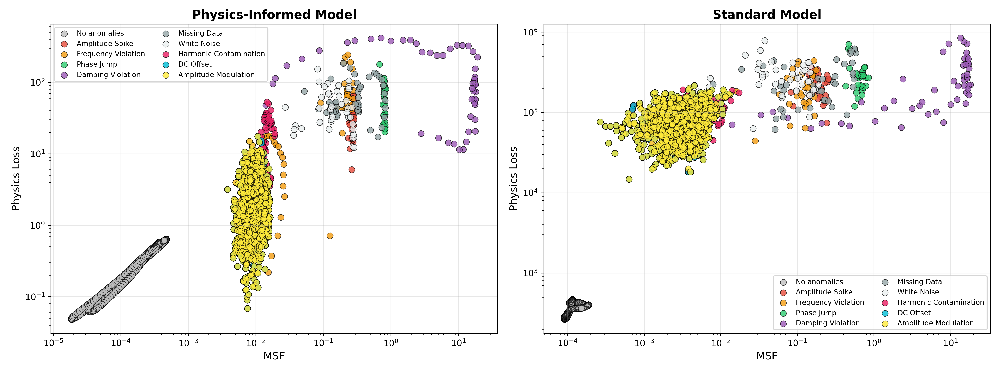

---

## What this demonstrates

* Unsupervised anomaly detection without labeled anomalies
* Physics-informed training induces **structure in representation space**
* This structure enables **anomaly type classification with simple models**
* The physics residual provides a signal channel unavailable to data-driven models — demonstrated both analytically and empirically
* Separation persists under:
  * noisy signals (~10% noise)
  * variable anomaly strength and duration
  * varying signal parameters (frequency, amplitude, phase)
  * different dataset scales (10k vs 400k timesteps)

---

## Problem setting

Most anomaly detection systems answer:

> "Is this anomalous?"

This project explores:

> "What *kind* of anomaly is this?"

This is a harder question. Anomalies are not binary events — a frequency drift behaves differently from
an amplitude spike in how it violates the underlying physics, and those differences leave a geometric
signature in the model's loss space. Exploiting that signature enables type-level classification without
any labeled anomalies at training time.

Detection and classification are also in tension as a dual-objective optimisation problem: thresholds
that maximise detection rate suppress fine-grained classification signal, and vice versa. Hyperparameters
(Optuna, 50 trials) are Pareto-optimised for simultaneous gains on both objectives.

---

## Core idea

Two complementary signals are extracted from each time window:

* **Reconstruction loss (MSE):** measures data fidelity — how well the model reconstructs the signal
* **Physics loss:** measures deviation from known system dynamics — how much the signal violates the governing equation

Each window is mapped to a 2D feature vector:

```
z = (log MSE, log Physics Loss)
```

Different anomaly types occupy distinct regions of this space. A frequency drift raises physics loss
strongly; an amplitude spike raises MSE; damping affects both in a characteristic ratio. This geometry
is the classifier — the downstream model is intentionally simple to make that clear.

---

## Pipeline

### Stage 1 — Unsupervised detection

* Train LSTM autoencoder on clean signals (no anomaly labels)
* Compute (log MSE, log physics loss) per window at inference time
* Fit per-axis percentile thresholds on clean calibration data
* Flag windows where MSE or physics loss exceeds the 99th-percentile threshold as anomalous

### Stage 2 — Anomaly type classification

Two classifiers are evaluated on detected anomalies, using the same 2D loss features:

**Supervised:** k-Nearest Neighbours (k=5) trained on labeled anomaly examples

**Unsupervised:** Gaussian Mixture Model (GMM) fitted without any anomaly labels, evaluated
via precision-coverage tradeoff as confidence threshold is swept

---

## Experimental setup

### Data

* Simulated simple harmonic oscillator
* ~10% additive noise
* Training data varies across frequency, amplitude, and phase to avoid trivial overfitting to a single signal
* **Small dataset:** 20 segments × 500 timesteps = 10k timesteps
* **Large dataset:** 200 segments × 2000 timesteps = 400k timesteps

### Anomalies

Nine anomaly types, each with **variable strength and duration**:

| Class | Description |
|---|---|
| Amplitude spikes | Sudden jump in signal magnitude |
| Amplitude modulation | Gradual envelope variation |
| Damping violations | Unphysical decay or growth |
| Frequency violations | Drift from nominal frequency |
| Phase discontinuities | Instantaneous phase jumps |
| Harmonic contamination | Added harmonic components |
| White noise bursts | Localized broadband noise |
| DC offset shifts | Baseline level changes |
| Missing data | Signal dropout |

Variable strength and duration mean anomalies span a range of severities — weak, short anomalies
approach the noise floor, making them genuinely hard to detect and separate from clean variation.

---

## Baseline

To isolate the contribution of physics constraints, two LSTM variants are compared:

**Standard LSTM** — trained with reconstruction loss only (MSE)

**Physics-Informed LSTM (PINN)** — trained with combined reconstruction + physics loss

Both use the same downstream pipeline. Any performance difference is attributable to the loss geometry
induced by the physics term.

---

## Results

### Effect of dataset scale

Physics-informed training helps in both regimes, but in different ways:

| Metric | Small dataset (10k steps) | Large dataset (400k steps) |
|---|---|---|
| Detection AUC — PINN | 0.860 | 0.857 |
| Detection AUC — Standard | 0.822 | 0.821 |
| **Detection AUC advantage** | **+3.8pp** | **+3.7pp** |
| kNN micro-class accuracy — PINN | 0.609 | 0.633 |
| kNN micro-class accuracy — Standard | 0.477 | 0.607 |
| **kNN classification advantage** | **+13.3pp** | **+2.6pp** |
| GMM micro-class accuracy — PINN | 0.538 | 0.532 |
| GMM micro-class accuracy — Standard | 0.423 | 0.472 |
| **GMM classification advantage** | **+11.5pp** | **+6.0pp** |

The detection advantage is stable across scales. The classification advantage is largest on the small
dataset — with limited data, the physics constraint is the primary source of geometric structure in loss
space. With a large dataset, the standard model learns enough of that structure from data alone,
narrowing the gap.

### Detection

Per-axis percentile thresholding achieves high recall without any labeled anomalies. The physics-informed
model consistently outperforms the standard model on detection AUC across anomaly types and frequencies.

**Small dataset — AUC vs frequency:**

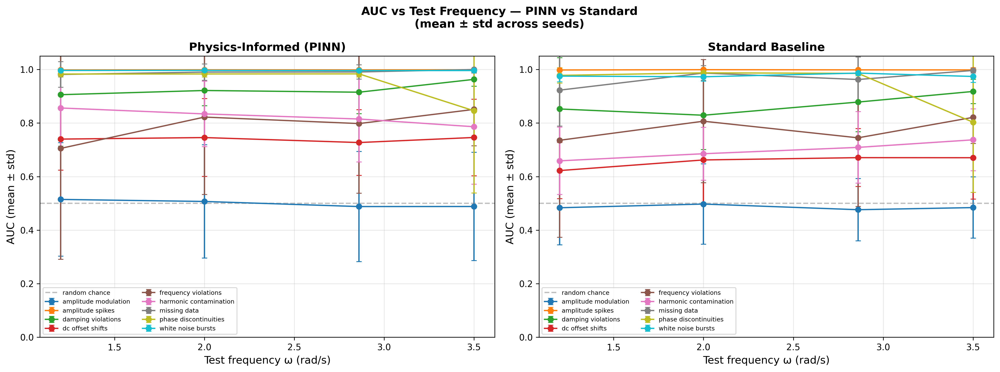

**Large dataset — AUC vs frequency:**

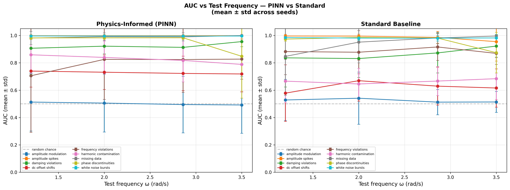

### Classification (supervised kNN)

kNN in 2D loss space separates anomaly types with meaningful accuracy. Physics-informed features
improve both detection and fine-grained classification over the standard model, with the advantage
most pronounced on the small dataset.

**Small dataset:**

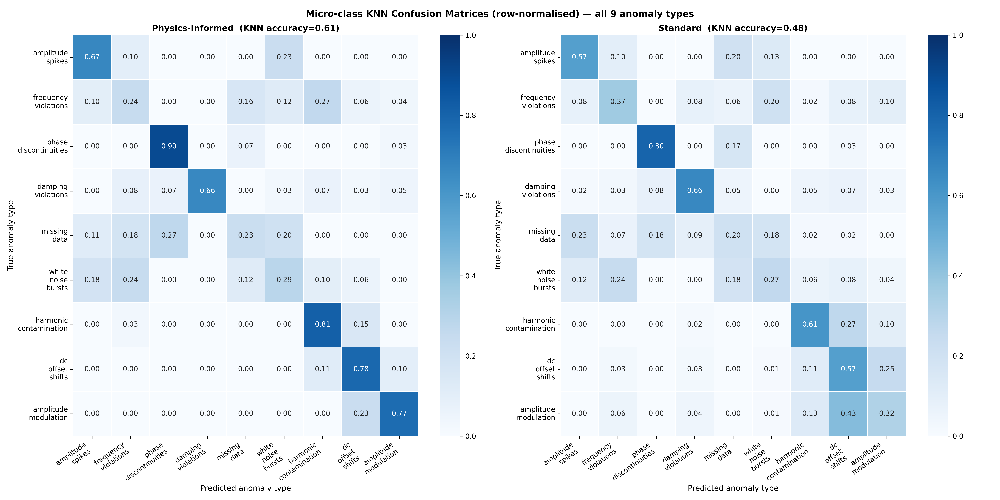

**Large dataset:**

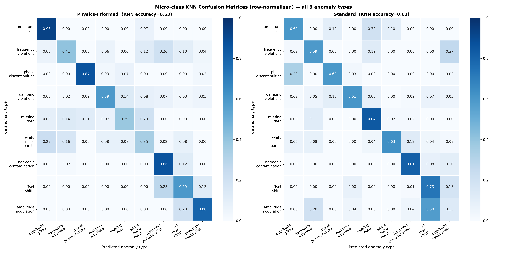

### Classification (unsupervised GMM)

A GMM is fitted in the same 2D space without any anomaly labels. Performance is measured via
precision-coverage tradeoff: as the confidence threshold rises, fewer windows are classified but
those that are classified are more accurate.

**Small dataset:**

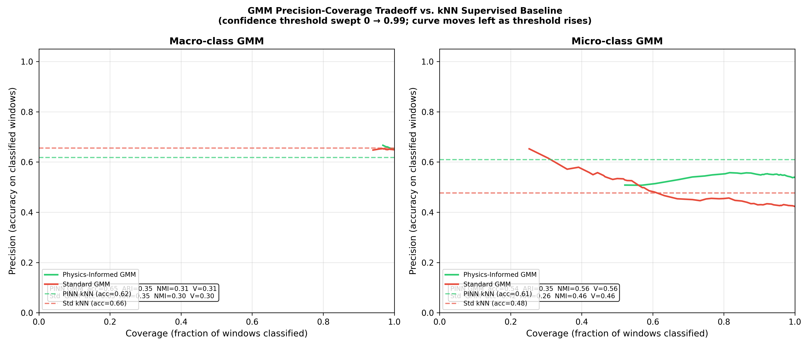

**Large dataset:**

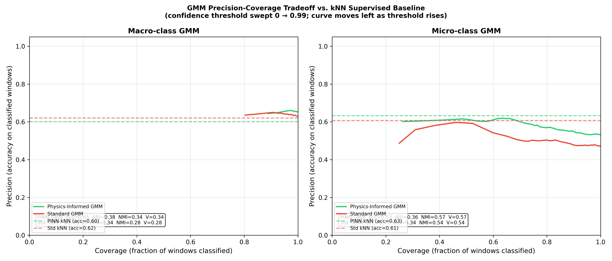

### End-to-end pipeline

The full detect → classify pipeline is evaluated end-to-end. The "normal" column in the confusion
matrix below represents missed detections; other columns show the classifier's type assignment.

**Small dataset (kNN classifier):**

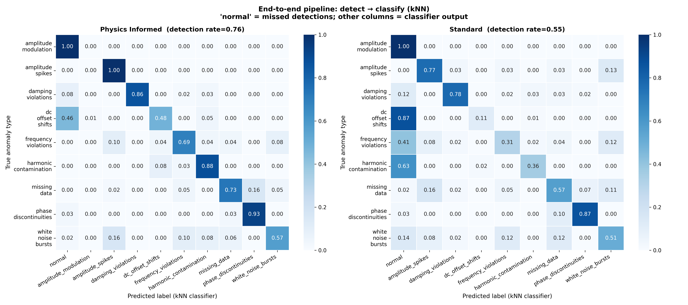

**Large dataset (kNN classifier):**

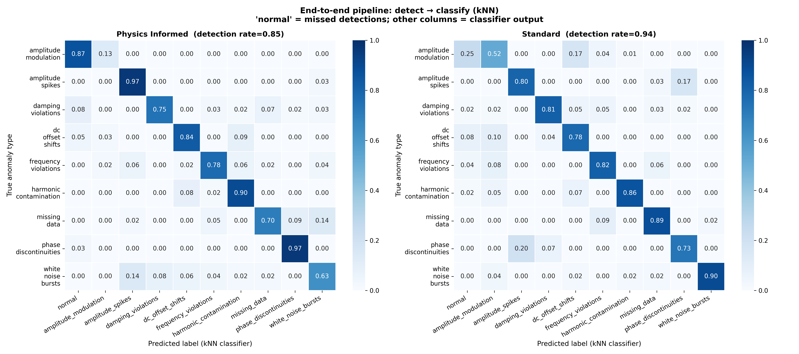

### Loss space geometry

The 2D scatter shows anomalous windows overlaid with per-axis classification thresholds.
Cluster coherence is substantially clearer for the physics-informed model.

**Small dataset:**

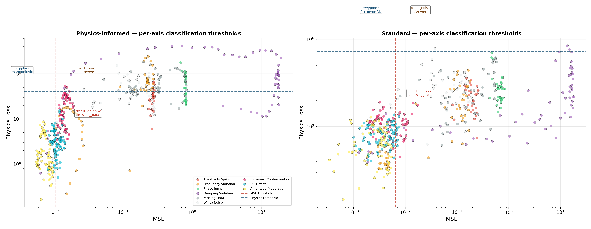

**Large dataset:**

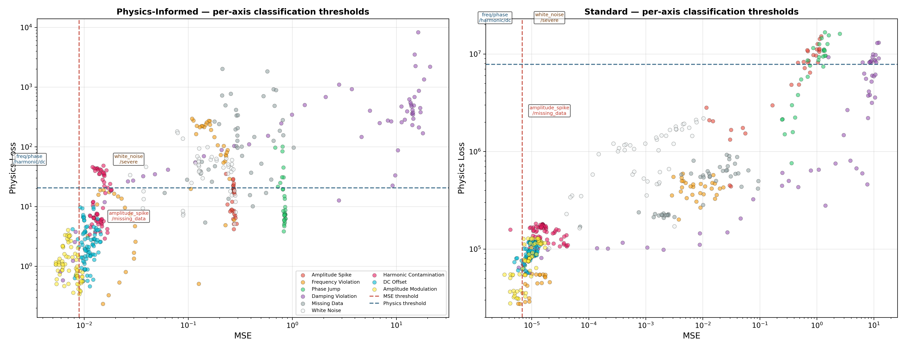

---

## Key insight

The model is not trained to classify anomaly types.

Instead:

> Physics-informed loss shapes the geometry of the loss space, making anomaly types separable —
> both for supervised and fully unsupervised classifiers.

The physics residual acts as an anomaly discriminator, providing a signal channel that is structurally
unavailable to data-driven models. This is demonstrated analytically (the residual of the harmonic
oscillator equation is non-zero only when the signal deviates from physical behaviour) and empirically
(the classification advantage is largest precisely when data is scarce and the physics constraint
provides the only reliable source of geometric structure).

---

## Design choices

**Why LSTM?**
Captures temporal dependencies; the physics loss is computed on the reconstructed sequence, so
temporal coherence matters.

**Why per-axis percentile threshold?**
Fits independently on clean calibration data for each axis (MSE and physics loss), requiring no
labeled anomalies. Per-axis thresholding naturally partitions the 2D space into detection quadrants
aligned with the anomaly macro-classes.

**Why kNN?**
Used intentionally to demonstrate that performance comes from representation structure, not
classifier complexity. A more complex classifier would obscure that point.

**Why GMM as unsupervised classifier?**
Tests whether the geometric structure induced by physics-informed training is strong enough for
purely unsupervised type discovery — no labels anywhere in the pipeline.

**Why Optuna for hyperparameter optimisation?**
Detection and classification are in tension as objectives. Optuna's Pareto-front search (50 trials)
identifies hyperparameters that improve both simultaneously rather than trading one off against the other.

---

## Assumptions and limitations

* Physics loss assumes access to system frequency (can be estimated via FFT in practice)
* kNN classifier generalizes only to anomaly types seen during training
* GMM assumes roughly Gaussian cluster shapes; spectrally similar classes share loss geometry
  and are not cleanly separable under this assumption
* Evaluation is on simulated data; real sensor signals would introduce additional non-stationarity

---

## Future work

* **HDBSCAN for unsupervised classification** — handles non-Gaussian cluster shapes and naturally
  produces an uncertain class for ambiguous windows, giving better-calibrated abstentions than GMM
* **Additional features for spectral anomalies** — a frequency-domain feature (e.g. spectral entropy
  of the residual) as a third axis would likely break the harmonic/noise degeneracy
* **Calibrated GMM confidence** — temperature scaling on GMM posteriors to improve precision-coverage
  curve shape and make abstention decisions more trustworthy
* **Robustness to frequency estimation error** — evaluate effect of using FFT-estimated vs. ground-truth frequency in the physics loss
* **Real-world sensor datasets** — industrial vibration or ECG data as next validation target

---

## File structure

```
project/
  main.py                   — full pipeline: train, threshold, evaluate, visualise
  sweep.py                  — multi-seed / multi-frequency sweep runner
  sweep_optuna.py           — Pareto HPO sweep (Optuna, 50 trials)
  eval_more_seeds.py        — extended seed evaluation
  requirements.txt
  src/
    config.py
    model.py
    dataset.py
    train.py
    evaluate.py
    threshold.py            — per-axis percentile threshold fitting and detection
    detection_metrics.py    — ROC/AUC, precision/recall, e2e classification eval
    quantitative_metrics.py — kNN and GMM classification, physics loss reduction
    test_suite_runner.py
    theoretical_analysis.py — analytical derivation of physics residual as discriminator
    visualise.py
    utils.py
  results/
    final_small_dataset/    — full results for 10k-timestep training run
    final_large_dataset/    — full results for 400k-timestep training run
```

---

## How to run

```bash
python main.py
```

Set `train_again=True` in `main.py` to retrain the model from scratch.

---

## Dependencies

```
numpy
pandas
scikit-learn
matplotlib
seaborn
torch
mlflow
optuna
```
